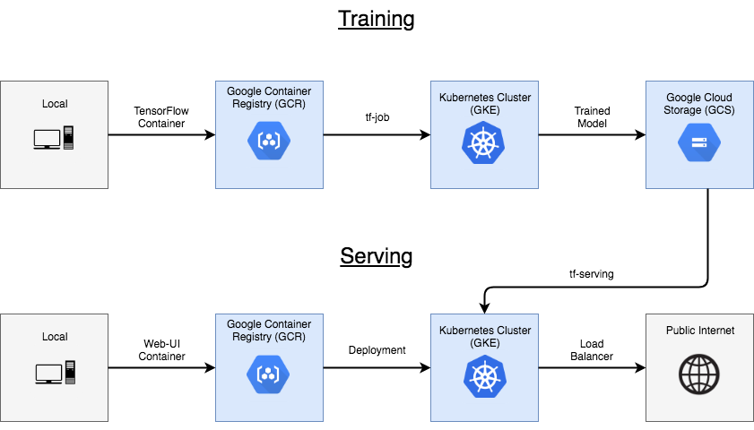

# Serve Model on Cloud with Kubernetes and TF Model server

Fortunately, distributed workloads are becoming easier to manage, thanks to Kubernetes. Kubernetes is a mature, production ready platform 
that gives developers a simple API to deploy programs to a cluster of machines as if they were a single piece of hardware. Using Kubernetes
, computational resources can be added or removed as desired, and the same cluster can be used to both train and serve ML models.

## What will we do

This guide will describe how to train and serve a TensorFlow model, and then how to deploy a web interface to allow users to interact 
with the model over the public internet. You will build a classic handwritten digit recognizer using the MNIST dataset.

We will use the following workflow to do so:



We will discretely follow these steps:

- Build a training image using your TensorFlow model code and Kubeflow's Fairing.
- Set up and run a distributed training job using TFJob.
- **Serve the resulting model using TensorFlow Serving.**
- Deploy a web app that uses the model

## What you need

- An active GCP project
- Basic TF Model server knowledge
- Basic model building knowledge in Keras

## Project setup

- Make sure you have selected a project
- Set an environment variable called `DEPLOYMENT_NAME`

```bash
export DEPLOYMENT_NAME = kf-mnist
```

- Ensure you set a zone
- Enable few APIs, you would need to enable a few APIs run this in the cloud shell to do so:

```bash
gcloud services enable \
  cloudresourcemanager.googleapis.com \
  iam.googleapis.com \
  file.googleapis.com \
  ml.googleapis.com
```

This might take a minute or so to run.

### Set up OAuth Client

* Navigate to [Oauth Consent Screen](https://console.cloud.google.com/apis/credentials/consent)
  * In the Application name box, enter the name of your application
  * Under Authorized domains, enter `<project_id>.cloud.goog`
  * Save it
* Naviagte to [Credentials screen](https://console.cloud.google.com/apis/credentials)
  * Click Create credentials, and then click OAuth client ID.
  * Under Application type, select Web application.
  * In the Name box enter any name for your OAuth client ID. This is not the name of your application nor the name of your Kubeflow deployment. It’s just a way to help you identify the OAuth client ID.
* Click Create > Copy the client ID
* On the Create credentials screen, find your newly created OAuth credential and click the pencil icon to edit it
* In the Authorized redirect URIs box, enter the following:

```
https://iap.googleapis.com/v1/oauth/clientIds/<CLIENT_ID>:handleRedirect
```

  * `<CLIENT_ID>` is the OAuth client ID that you copied from the dialog box in step four. It looks like `XXX.apps.googleusercontent.com`.
  * Note that the URI is not dependent on the Kubeflow deployment or endpoint. Multiple Kubeflow deployments can share the same OAuth client without the need to modify the redirect URIs.
* Save it
* Make a note of client ID and client secret, we will be using that

## Create a Kubeflow cluster

### Create a cluster

Create a managed Kubernetes cluster on Kubernetes Engine by visiting the Kubeflow Click-to-Deploy site in your browser and signing in 
with your GCP account

[Kubeflow Click-to-Deploy](https://deploy.kubeflow.cloud/)

* Project: Enter your GCP `$PROJECT_ID` in the top field
* Deployment name: Set the default value to `kf-mnist`.
* In the Choose how to connect to kubeflow service dropdown, select `"Login with GCP IAP"`. Then, for the IAP client ID and client secret fields, enter the OAuth credentials that you created in the previous section.
* GKE Zone: Use the value you have set for `$ZONE`, selecting it from the pulldown.
* Kubeflow Version: `v1.0.0` or greater

Generate the cluster by clicking Create Deployment. This will create a deployment object with everything necessary for installing Kubeflow, e.g. GKE resource requirements, service accounts, etc. You should receive something like this


